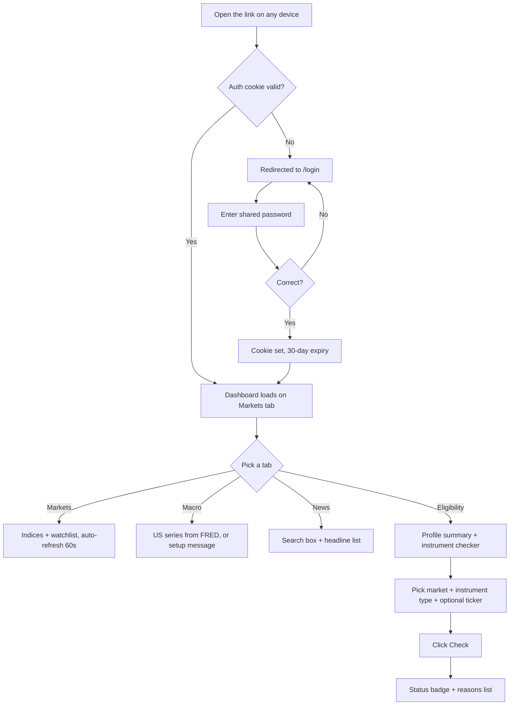

# v1.0 User Flow

## End-to-end flow

## Step-by-step

**1. Opening the link.** Every route except `/login` and `/api/login` is
covered by `middleware.ts`. It checks for a cookie named `awos_auth` with
value `granted`. No cookie, or wrong value → redirected to `/login?next=<where you were going>`
so you land back where you meant to go after authenticating.

**2. Logging in.** `/login` is a plain form (`app/login/page.tsx`) that POSTs
to `/api/login`. That route compares the submitted password against
`SITE_PASSWORD` (env var, falls back to the default in `lib/auth.ts`), and on
success sets the `awos_auth` cookie (httpOnly, secure, 30-day max age) and
redirects to `next`. Wrong password re-renders `/login` with `?error=1`,
which the page reads to show "Wrong password. Try again."

**3. Landing on the dashboard.** `app/page.tsx` renders the `Dashboard`
client component, which defaults to the **Markets** tab. Tab state lives in
React state only — refreshing the page always returns to Markets.

**4. Markets tab.** On mount, two independent polling loops start (one for
the fixed index list, one for the watchlist), each hitting `/api/quote` and
re-fetching every 60 seconds. Each row shows label, ticker, last price,
percent change (colored), and market (US/India tag).

**5. Macro tab.** On mount, a single fetch to `/api/macro`. If `FRED_API_KEY`
isn't set server-side, the response includes a `message` explaining how to
get one, and every series shows as `—`. If it is set, real numbers appear
with the observation date.

**6. News tab.** Defaults to a query of `stock market OR macroeconomy`; typing
in the search box re-fetches `/api/news?q=...` on every change (no debounce
in v1.0 — see the roadmap for that gap). Each headline links out to the
source article in a new tab.

**7. Eligibility tab.** Shows your hardcoded profile summary first (from
`lib/profile.ts`), then a checker: pick a market, an instrument type, and
optionally type a ticker (not currently used in the logic — see
`04-ELIGIBILITY-LOGIC.md`), click Check, and get a status badge plus a list
of specific reasons. This runs entirely client-side against the imported
rules module — no network round trip, no persistence of what you checked.

## What's conspicuously absent from this flow

There's no onboarding, no editable settings screen, no save/export, and no
notion of "session" beyond the auth cookie. Every piece of state that isn't
live market data is a source file you'd edit and redeploy. This is
deliberate for v1.0 (see `00-OVERVIEW.md`) but is the first thing
`v2-research/PROPOSAL.md` addresses.
