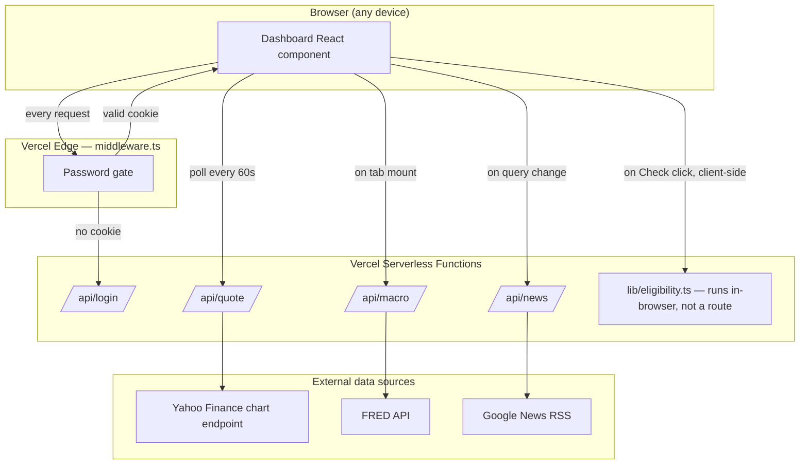

# v1.0 Architecture

## Stack

Next.js 14 (App Router) + TypeScript + Tailwind CSS, deployed on Vercel as
serverless/edge functions. No database. No auth provider. No build-time
secrets baked in beyond a default password constant (overridable via env
var). Deployed directly from a generated file tree via the Vercel API (no
git repo backing it in v1.0 — see the gap noted in `v2-research/PROPOSAL.md`).

## Component diagram

## Request lifecycle for a page load

1. Request hits Vercel's edge network.
2. `middleware.ts` runs first (edge runtime) — checks the `awos_auth`
   cookie, either passes the request through or redirects to `/login`.
3. If authenticated, the App Router serves `app/page.tsx` → `Dashboard`
   (client component, `'use client'`), hydrated in the browser.
4. `Dashboard` mounts its currently-active tab's sub-component, which fires
   its own `fetch()` calls to the relevant `/api/*` route.
5. Each API route is `export const dynamic = 'force-dynamic'` — no static
   caching at the Next.js layer; each route does its own upstream fetch with
   a short `next: { revalidate: N }` hint (30s for quotes, 300s for news,
   3600s for macro) so Vercel's data cache absorbs repeat hits within that
   window.

## Why client components, not server components, for the dashboard

Everything in `components/Dashboard.tsx` is client-rendered (`'use client'`)
rather than using React Server Components with server-side data fetching.
This was a deliberate v1.0 simplification: polling (Markets), on-demand
re-fetch (News search), and a purely client-side rules engine (Eligibility)
all fit a "fetch in `useEffect`, render from `useState`" model with minimal
code. The cost is a slightly heavier client bundle and no streaming/SSR
benefit for first paint. `v2-research/PROPOSAL.md` covers whether that
trade-off should change as more modules land.

## Why middleware + shared password instead of a real auth provider

Documented explicitly in `lib/auth.ts` and the top-level `README.md`: this
is a single-user tool, so a shared secret behind an httpOnly cookie clears
the actual bar ("keep strangers out") without the complexity of accounts,
sessions, or a user table. It stops mattering the moment a second person
needs independent access — at that point this whole auth layer needs
replacing, not extending.

## Deployment topology

- **Project:** `ai-wealth-os` on Vercel, team `sudhanva15s-projects`.
- **Production alias:** `ai-wealth-os-lemon.vercel.app` (also reachable via
  `ai-wealth-os-sudhanva15s-projects.vercel.app`).
- **Deployment protection:** Vercel's own SSO/Authentication protection is
  explicitly disabled at the project level (`update_project_deployment_protection`)
  so the link works without a Vercel account on the accessing device — the
  app-level password is the only gate. Vercel's native password protection
  was left off too (it's a Pro-plan feature); the app-level gate substitutes
  for it on the free Hobby plan.
- **No git repo.** Deploys happen by pushing a generated file tree straight
  to Vercel. This means there's no commit history, no diff review, no CI —
  redeploying means regenerating and re-pushing the whole tree. Flagged as a
  real gap in `v2-research/PROPOSAL.md`.
